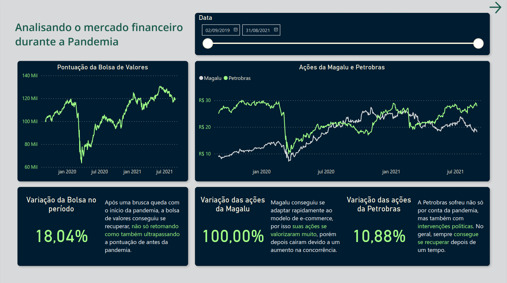
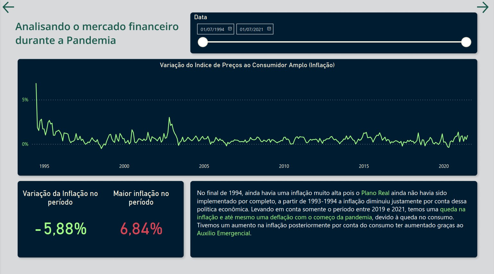
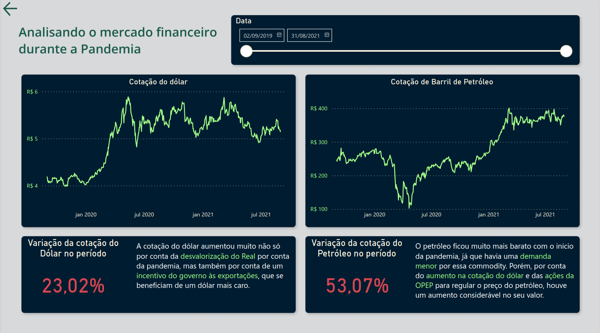
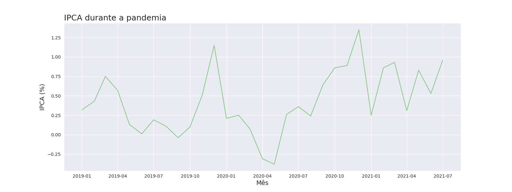
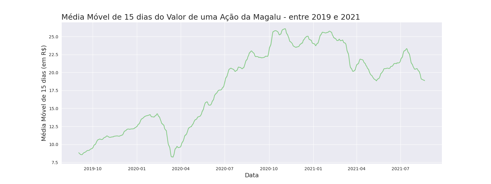
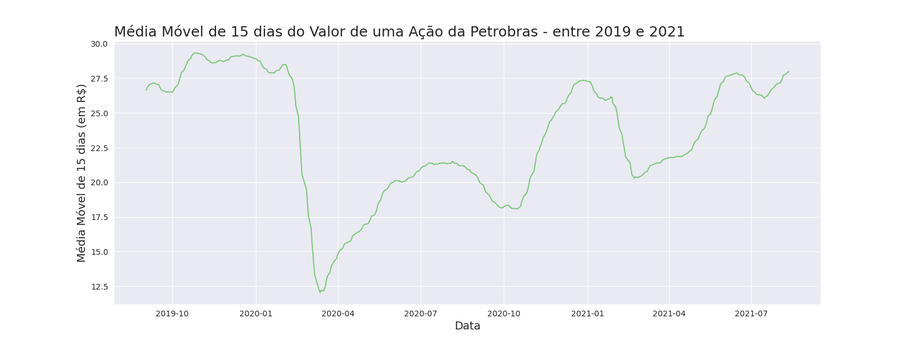
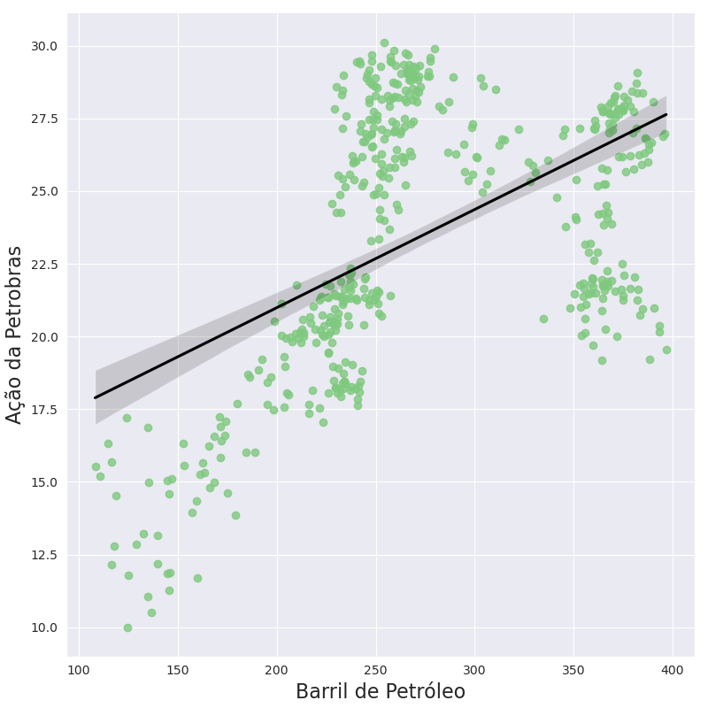

# Analisando o mercado fincanceiro durante a pandemia

> Status: Concluído

O projeto foi feito inteiramente em python com o objetivo de analisar o impacto da pandemia no mercado financeiro do Brasil, assim como as causas por trás das altas e quedas nas métricas estudadas. Contém dados de 2019 até 2021 apenas.

| :placard: Vitrine.Dev |                                     |
| --------------------  | ----------------------------------- |
| :sparkles: Nome       | **Mercado financeiro na pandemia**  |
| :label: Tecnologias   | Python, Jupyter Notebook, Power BI  |

## Páginas do Dashboard

## Questões analisadas

A primeira métrica analisada foi a inflação e seu comportamento durante a pandemia. Em seguida foi feita a análise das ações de duas empresas: Magalu e Petrobras. Com a finalidade de construir um modelo de regressão para tentar prever o comportamento das ações da Petrobras, coletei dados sobre a cotação de um barril de petróleo, a cotação do dólar e até mesmo a pontuação da IBOVESPA (bolsa de valores brasileira).

### [Fonte dos dados usados no projeto](http://www.infomoney.com.br)

## Algumas análises e gráficos

### IPCA

Analisando o gráfico podemos ver que a inflação diminui bastante com o começo da pandemia, por conta da queda no consumo e da insegurança com relação à situação, contudo antes dessa queda houve um leve pico na inflação visto que as pessoas estavam comprando muitos produtos essenciais numa tentativa de se prepararem para o corona vírus. Depois, com o auxílio emergencial e o abrandamento das restrições, houve mais uma vez um aumento considerável no consumo e consequentemente na inflação.

### Magalu

Esse gráfico mostra como as ações da magalu se valorizaram muito na pandemia, após uma queda inicial, essa valorização aconteceu por conta da rápida adaptação da empresa ao e-commerce e também há uma diminuição da concorrência nesse período. A partir de 2022, a empresa começa a passar por momentos difíceis, perdendo valor por conta da alta concorrência com grandes competidores internacionais, como Ali Express, Amazon, Shein, Shopee e entre outros. Outro fator que prejudicou a empresa foi a alta na taxa de juros (Selic) que acaba impactando empresas de varejo.

### Petrobras

A Petrobras operou com uma queda de mais de 50% no começo da pandemia, mas conseguiu se recuperar lentamente, passando por mais algumas desvalorizações por conta de instabilidades políticas e mudanças na administração interna da empresa, que aconteceram em outubro de 2020 e no início de 2021, porém no geral a empresa conseguiu manter resultados satisfatórios no mercado financeiro.

### Ibovespa

A bolsa de valores brasileira seguiu um padrão parecido com as empresas citadas anteriormente, com uma queda considerável no começo de 2020 seguida por uma recuperação lenta. No caso da Ibovespa podemos perceber que com a chegada de 2021, a bolsa conseguiu superar até mesmo sua pontuação antes da pandemia começar.

### Barril de Petróleo

Vemos que em março de 2020 o petróleo ficou bem mais barato por conta da queda na demanda inicialmente, seguida por uma estabilização no preço. Por conta da desvalorização contínua do Real com relação ao dólar, o petróleo se tornou mais caro a partir de 2021.

### Correlação entre Petróleo e Petrobras

Podemos notar que a correlação entre o preço do petróleo e as ações da Petrobras não aparenta ser tão forte e nem ter um comportamento linear, o que já era esperado, visto que os dados usados não são extensos o suficiente, além de que o mercado financeiro é complexo de modo que prever com precisão seus resultados não é possível, mesmo se mais dados e variáveis fossem utilizadas. Ações humanas influenciam o mercado financeiro, e muitas vezes as ações que tomamos não seguem uma lógica previsível.

---
